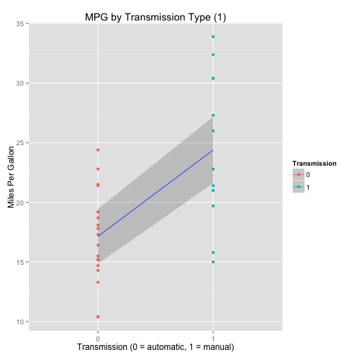
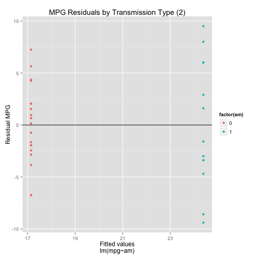
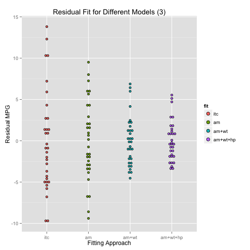
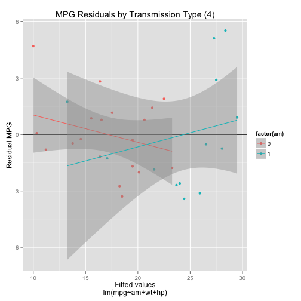
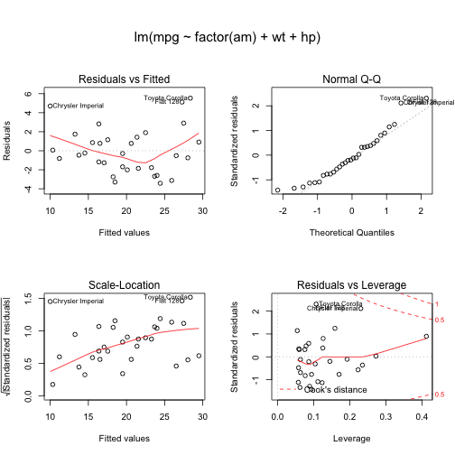

##Executive Summary

We explored MPG (Miles/(US) gallon) for for 32 automobiles (1973–74 models) by type of transmission (automatic or manual). We concluded that **manual transmission vehicles have higher MPG** when disregarding other factors. _This conclusion does not hold at a 95% confidence interval when holding weight and horsepower constant_. We looked at these two factors since they had a strong and understandable, negative effect on MPG. We demonstrate these conclusion through a number of different linear models, statistics, inferences, and plots.

##Analysis

For purposes of this analysis, 0 = automatic and 1 = manual for transmission type.

###Phase 1

Our initial analysis was to fit a model with mpg as the outcome and transmission type as the confounder.

|            | Estimate| Std. Error| t value| Pr(>&#124;t&#124;)|
|:-----------|--------:|----------:|-------:|------------------:|
|(Intercept) |    17.15|       1.12|   15.25|                  0|
|factor(am)1 |     7.24|       1.76|    4.11|                  0|

As we can see in the results from the table above there is a **7.24 MPG increase for manual transmisions over automatic transmissions**. We can see these results plotted in [figure 1](#mpgAmPlot). We can confirm these results with the confidence interval below.

|            | 2.5 %| 97.5 %|
|:-----------|-----:|------:|
|(Intercept) | 14.85|  19.44|
|factor(am)1 |  3.64|  10.85|

Unfortunately, the residuals plot is not at all random in appearance leading us to believe there is a problem with our model [figure 2](#residPlotFit1).

This is supported by our adjusted R-squared value **0.34** which suggest only this proportion of the variance in mpg is explained by transmission type alone.

*******

###Phase 2

Given the problems with our initial model (which barely improves on the intercept only model for MPG). We tried to improve the fit of our model. This was done primarily through common sense regarding vehicles and playing around with the data. The final parsimonious model that was settled on looked at transmission type holding vehicle weight in lb/1000 and gross horsepower constant. 

[Figure 3](#residCompPlot) shows the reduced residual spread of our model. We also ran an analysis of variance table to ensure that the new factors we added to our model were significant and to review their impact on variance. This is shown below.

| Res.Df|     RSS| Df| Sum of Sq|      F| Pr(>F)|
|------:|-------:|--:|---------:|------:|------:|
|     30| 720.897| NA|        NA|     NA|     NA|
|     29| 278.320|  1|   442.577| 68.734|  0.000|
|     28| 180.291|  1|    98.029| 15.224|  0.001|

As we can see from the residual plot [Figure 4](#residPlotFit3) for our new model there is no discernible pattern which is what we are looking for with a robust model.

It is important to note that the predictive power of our model is greatly increased as shown by our adjusted R-squared value: **0.82**. Turning back to our analysis we review the summary of our new model:

|            | Estimate| Std. Error| t value| Pr(>&#124;t&#124;)|
|:-----------|--------:|----------:|-------:|------------------:|
|(Intercept) |    34.00|       2.64|   12.87|               0.00|
|factor(am)1 |     2.08|       1.38|    1.51|               0.14|
|wt          |    -2.88|       0.90|   -3.18|               0.00|
|hp          |    -0.04|       0.01|   -3.90|               0.00|

As we can see in the results from the table above there is a **much smaller 2.08 MPG increase for manual transmisions over automatic transmissions *when holding weight and horsepower constant***. 

_Our 95% confidence interval now includes negative values so we cannot be sure at this confidence level that manual transmissions get higher MPG_ as shown below.

|            |  2.5 %| 97.5 %|
|:-----------|------:|------:|
|(Intercept) | 28.590| 39.416|
|factor(am)1 | -0.736|  4.903|
|wt          | -4.732| -1.025|
|hp          | -0.057| -0.018|

As a final step we review the diagnostic plots for our new model and detect nothing anomalous [Figure 5](#summaryFit3).

##Plot Appendix

 

 

 

 

 
